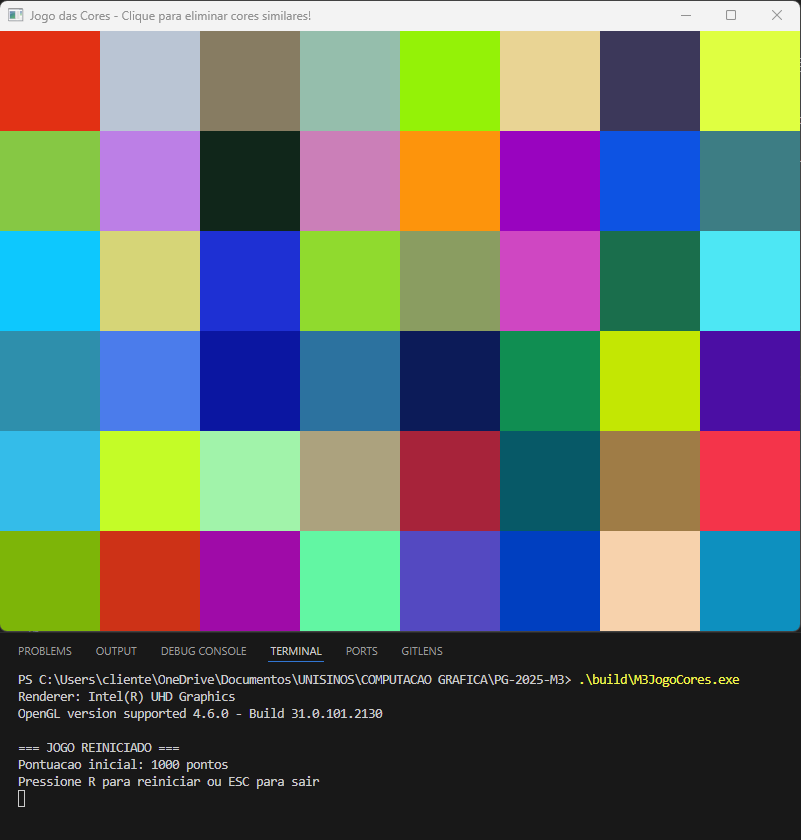
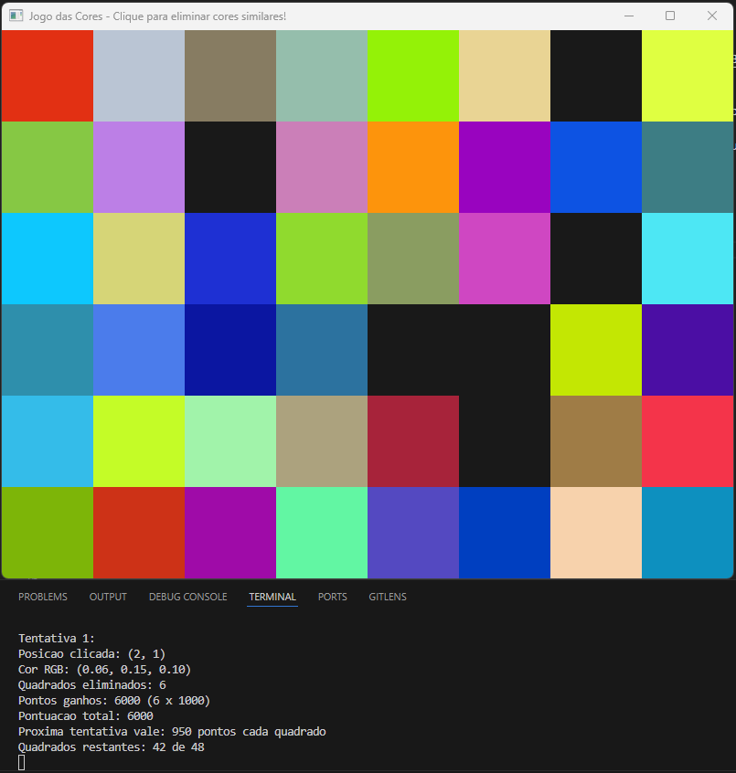
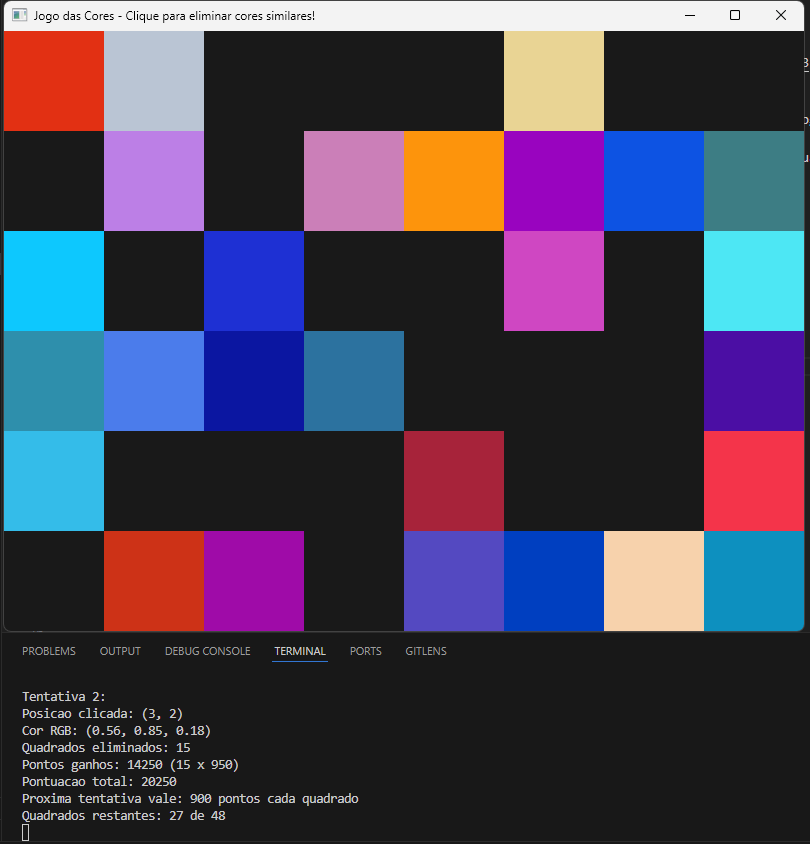
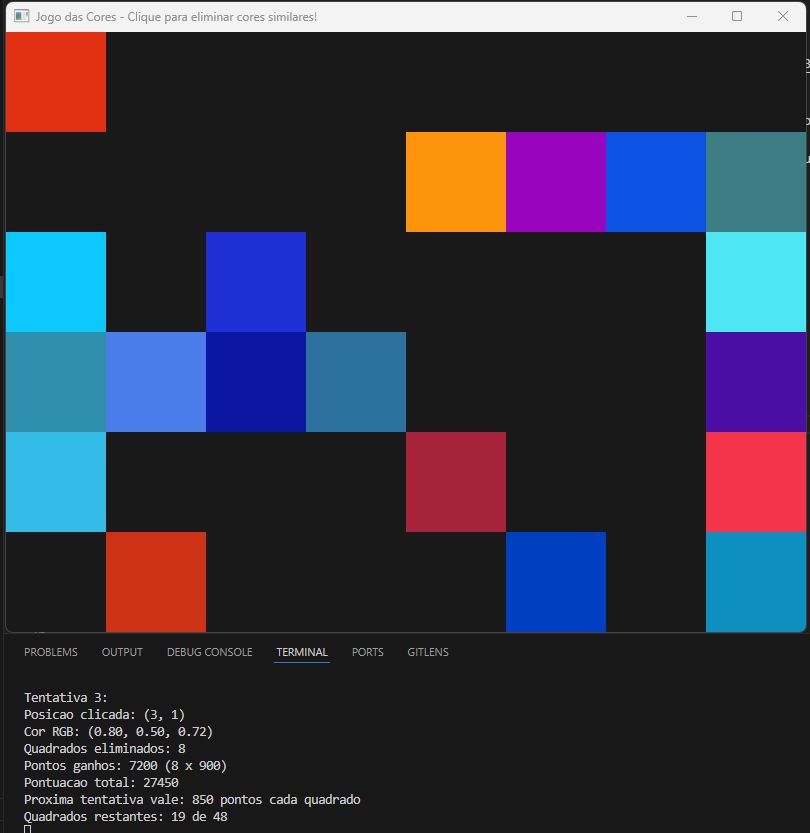
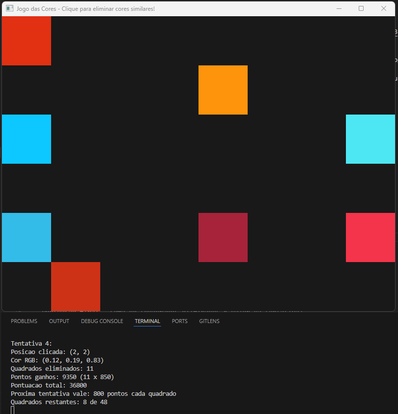
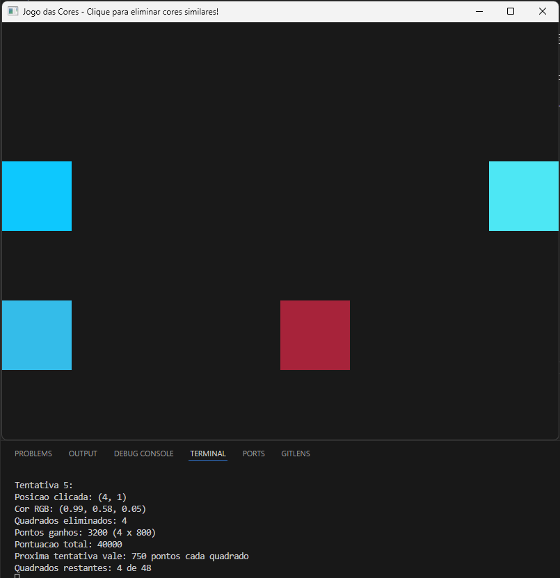
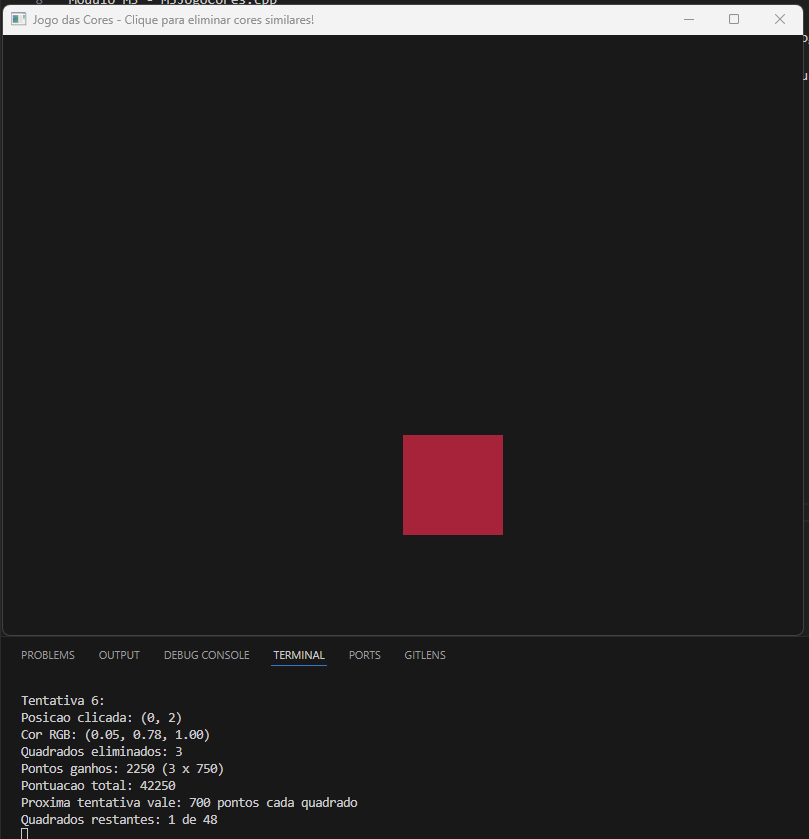
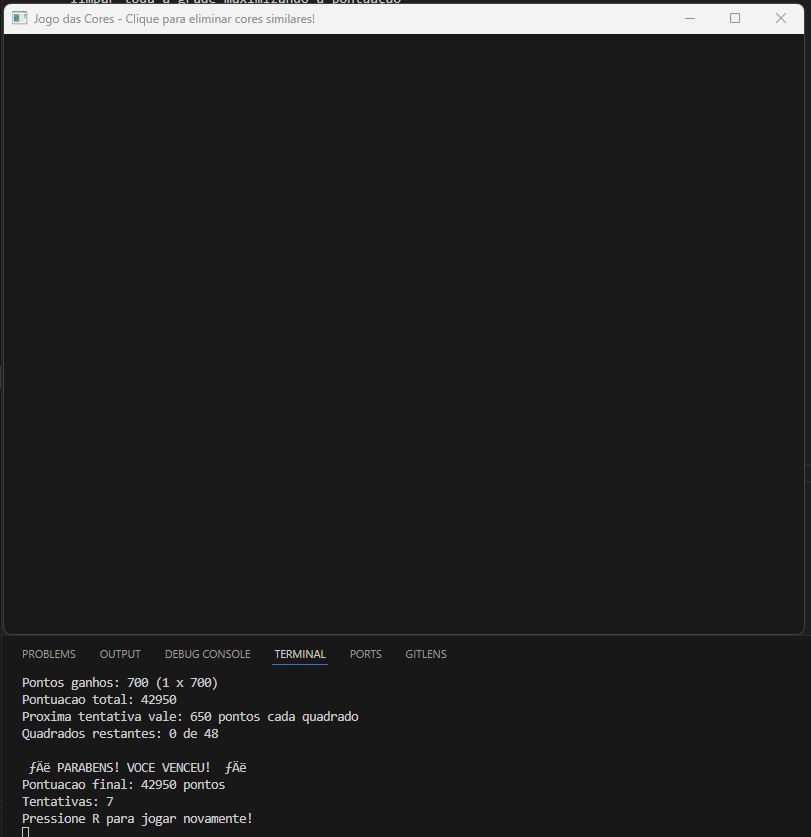

# PG-2025-M3

# Jogo das Cores

Código fonte desafio módulo 3 - Tarefa jogo das cores

O código foi adaptado a partir do repositório de exemplo: https://github.com/fellowsheep/PGCCHIB
Módulo M3 - M3JogoCores.cpp

Projeto desenvolvido para a disciplina de Processamento Gráfico, implementando um jogo onde o jogador deve eliminar quadrados com cores similares de uma grade colorida

O jogo apresenta uma grade de 6x8 quadrados com cores geradas aleatoriamente. Ao clicar em um quadrado, todos os quadrados com cores similares são eliminados. O desafio é limpar toda a grade maximizando a pontuação

Exemplo jogando:

## Tela inicial



## Primeiro clique



## Segundo clique



## Terceiro clique



## Quarto clique



## Quinto clique



## Sexto clique



## Sétimo clique FINAL



## Regras

- Cada tentativa começa valendo 1000 pontos por quadrado eliminado
- A cada nova tentativa, o valor diminui 50 pontos
- Pontuação final = soma de (quadrados eliminados × valor da tentativa)
- Vence quem conseguir eliminar todos os quadrados

## Controles

- **Mouse**: Clique esquerdo para selecionar cor
- **R**: Reinicia o jogo
- **ESC**: Fecha o programa (Pesquisa externa utilizada para implementar)

## Implementação Técnica

O projeto utiliza OpenGL 3.3+ com as tecnologias:

- **GLSL** para vertex e fragment shaders
- **VBO/VAO** para gerenciamento de geometria
- **Uniform variables** para comunicação com shaders
- **GLFW** para janelas e eventos de entrada
- **GLM** para operações matemáticas

### Cálculo de Similaridade (Pesquisadas maneiras de implementação na internet)

A similaridade entre cores é calculada usando distância euclidiana no espaço RGB:

```cpp
float d = sqrt(pow(C.r-O.r,2) + pow(C.g-O.g,2) + pow(C.b-O.b,2));
float distanciaNormalizada = d / sqrt(3.0);
```

Cores são consideradas similares quando a distância normalizada fica abaixo da tolerância definida (0.3).

### Dependências necessárias:

- OpenGL 3.3+
- GLFW
- GLAD
- GLM

### Executar no Windows (MinGW) - Utilizar CMake:

```bash
.\build\M3JogoCores.exe
```

## Estrutura do Código

- Inicialização do contexto OpenGL e shaders
- Grid implementada como array bidimensional de structs Quad
- Loop principal com renderização e processamento de eventos
- Sistema de eliminação baseado em comparação de cores RGB
- Gerenciamento de pontuação e estado do jogo
